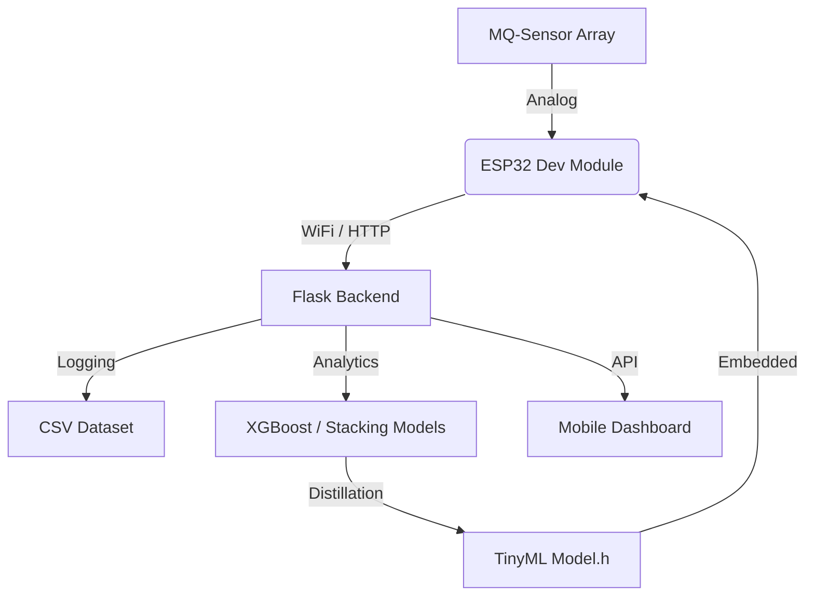

# 🏗 System Architecture Overview

This document describes the end-to-end architecture of the SnO2-Gas-Analytics system, detailing the data flow from physical sensors to machine learning inference.

## 🔄 End-to-End Data Flow

The system operates as a distributed IoT-ML pipeline:

1. **Data Acquisition (Edge)**:
   - ESP32 reads analog signals from the MQ-sensor array (MQ-2, MQ-135, MQ-7).
   - Local conversion from ADC counts to Voltage to Resistance.
2. **Feature Engineering (Edge & Cloud)**:
   - **Local**: Computation of transient features (change in resistance over time).
   - **Cloud**: Computation of log-space ratios and sliding-window statistics.
3. **Transmission (WiFi)**:
   - Structured JSON payloads are sent via HTTP POST to the central Flask backend.
4. **Processing & Storage (Cloud)**:
   - Flask server logs data to CSV and performs real-time drift compensation on baseline (R0) values.
5. **Inference (Edge)**:
   - The distilled TinyML Random Forest model performs local classification directly on the ESP32.

## 🗺 System Components

## 🔐 Security & Reliability

- **Buffer Management**: The ESP32 implements a 5-step circular buffer to handle networking jitter.
- **Error Handling**: Automatic recovery and retry mechanism for WiFi connectivity loss.
- **Normalization**: Rs/R0 normalization ensures that the system remains accurate even as sensors age or environmental humidity shifts.
